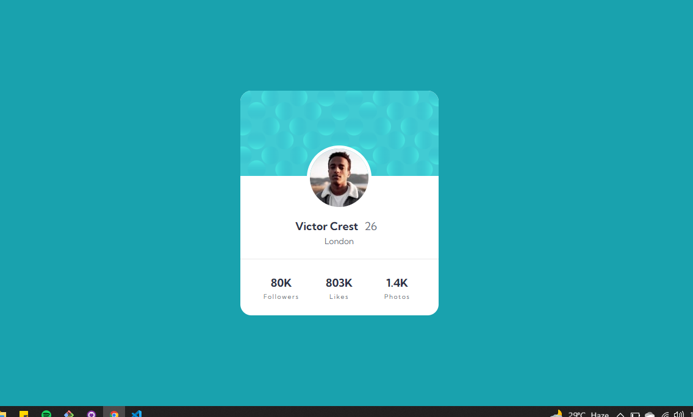
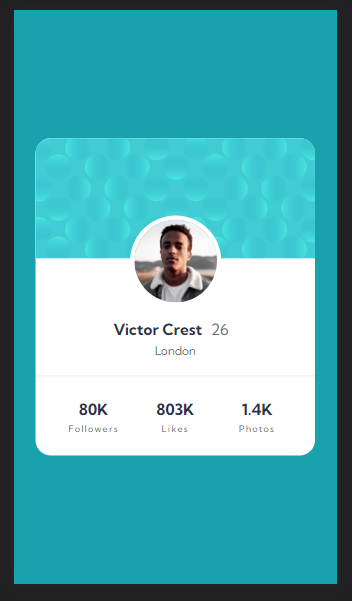

# Frontend Mentor - Profile card component solution

This is a solution to the [Profile card component challenge on Frontend Mentor](https://www.frontendmentor.io/challenges/profile-card-component-cfArpWshJ). Frontend Mentor challenges help you improve your coding skills by building realistic projects. 

## Table of contents

  - [The challenge](#the-challenge)
  - [Screenshot](#screenshot)
  - [Links](#links)
  - [Built with](#built-with)
  - [What I learned](#what-i-learned)
  - [Continued development](#continued-development)
- [Author](#author)

### The challenge

- Build out the project to the designs provided

### Screenshot
<!-- to be added -->

### Links

- Solution URL: [solution](https://github.com/mbilal-x/frontendmentor_P3_profile-card-component-main/edit/main)
- Live Site URL: [live site](https://mbilal-x.github.io/frontendmentor_P3_profile-card-component-main/)

### Built with

- Semantic HTML5 markup
- CSS custom properties
- Flexbox
- CSS Grid
- Mobile-first workflow

### What I learned
The design was fairly easy for me.
I learned that negative margin is useful when you want elements to overlap.

### Continued development
I failed to design the body background. I tried using position css property but still couldn't get it to work properly. I will work on the back ground again sometime.

### Author

- Website - [Muhammad Bilal](mohammadbilal.me)
- Frontend Mentor - [@mbilal-x](https://www.frontendmentor.io/profile/mbilal-x)
